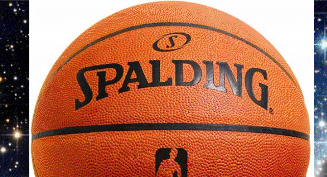

One of the most common tasks in Photoshop is extracting an object from an image into its own layer so you can superimpose the object over a different background. Lots of people use the magic wand tool to do this, and can't figure out why why their cutouts have these ugly white edges afterwards. Need an example?

Let's creating an invitation poster to a Space Jam party. We need basketballs in space. Let's use the magic wand tool to select and delete the background:

Okay, so far so good. Let's do the same thing for our main man, MJ:

Umm, that's no good. Check out that outline around him, clearly reducing the quality of this poster.

## What went wrong?
The magic wand tool selects areas of the image that are a similar colour to the area you click. The key word here is *similar*. Get familiar with the **tolerance** setting of the magic wand tool, which determines how similar colours need to be to be included in the selection. This setting is available in the options panel above the document. At its maximum value of 255, the magic wand will select every nonempty pixel in the layer regardless of colour. When tolerance is set to 0, the magic wand will only select pixels that *exactly* match the colour of the pixel you clicked on.

If you have the **Anti-alias** option enabled, Photoshop will partially select nearby pixels to smooth out your selection's border. Enabling **Contiguous** means Photoshop will only select pixels connected to each other rather than spread around the image.

When you get these borders, your tolerance is **too low** for the image you're working with. The edges of objects in photos are hardly ever perfect crisp transitions. Edges can be blurry, and compression in web-sourced images will further degrade the quality of the edge:

## What to do about it
Somewhere between 0 and 255 is a happy medium tolerance where you select mostly the pixels you want without selecting too much. It's going to depend on the resolution of the image, contrast of the edges, blurriness, and amount of compression. When I deleted MJ's background my tolerance was only set to 20, which was enough to capture those artifacts but not enough to get the lighter pixels on the boundary. Let's instead set it to 100 and clean up any problem areas using another selection tool:

Now we have a better selection. We can either delete the background, or invert our selection and create a mask on the current later. Masks are great because they're *nondestructive* and can be revised later. Invert the selection using `Select > Inverse` from the menu or `Ctrl + Shift + I`, then click the create mask button:

The white edge has been greatly diminished by choosing a better tolerance setting and refining our selection afterwards:

