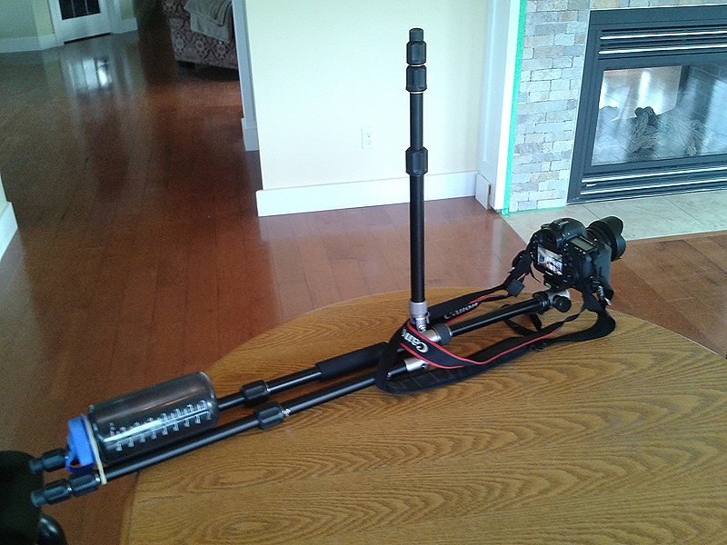

Last Saturday I took a day trip down to East Sooke Park with ['Bert](http://www.flickr.com/photos/28228492@N05/) for some hiking and photography. It was pouring out, but we were determined to head out anyway. A few wrong turns and backtracks later and we were in the Aylard farm parking lot, where search and rescue volunteers were still set up looking for [Robin Penwarn](http://www.timescolonist.com/police-call-off-search-for-missing-woman-in-east-sooke-park-1.779786). From talking to them I got the impression they didn't expect to find anything, unfortunately.

We took the coastal route with the goal of reaching Cabin Point, though we didn't quite make it that far and enjoyed lunch under a trailside bush, sheltered from the rain and wind.

I also took the opportunity to play around with Magic Lantern RAW video on my 5D3. I hardly ever shoot video, but it's something I want to do more often so this was a good learning experience.

<iframe width="853" height="480" src="//www.youtube.com/embed/StOx1k4gQX4" frameborder="0" allowfullscreen></iframe>

My workflow was to convert ML's RAW video files to DNG frames using [raw2dng](http://www.magiclantern.fm/forum/?topic=5404.0), then import the sequence into After Effects and use Camera RAW to edit/grade/sharpen. Once satisfied, I rendered the compositions to lossless AVI intermediates that I brought into Premiere for the final edit. I exported as H264 at 25 Mbps.

The results are so-so in my opinion. Some of the glaring problems are:
* Highly noticeable frame skipping
* No audio recording -- let ML record audio separately to the SD card
* Compression resulted in poor quality -- need higher than 25 Mbps
* Some parts are underexposed -- pay more attention to ACR settings across more frames than the first of each composition
* Excessive camera shake

The frame skipping is a result of my Lexar 1000x CF card being a bit too slow to handle 1920x1080 RAW at 29 FPS. Though I noticed this happening as I was recording, I forgot I hadn't enabled Magic Lantern's FPS override to 24 FPS so maybe that would allow me to shoot at 1080p without issue. Shooting at a wider aspect ratio than 16:9 would also help.

A setup like this really reduced the camera shake:

It has the advantage of not requiring any extra gear aside from what I usually take hiking when I expect to use the tripod. On the downside, I can't easily reach the camera to adjust focus or aperture.