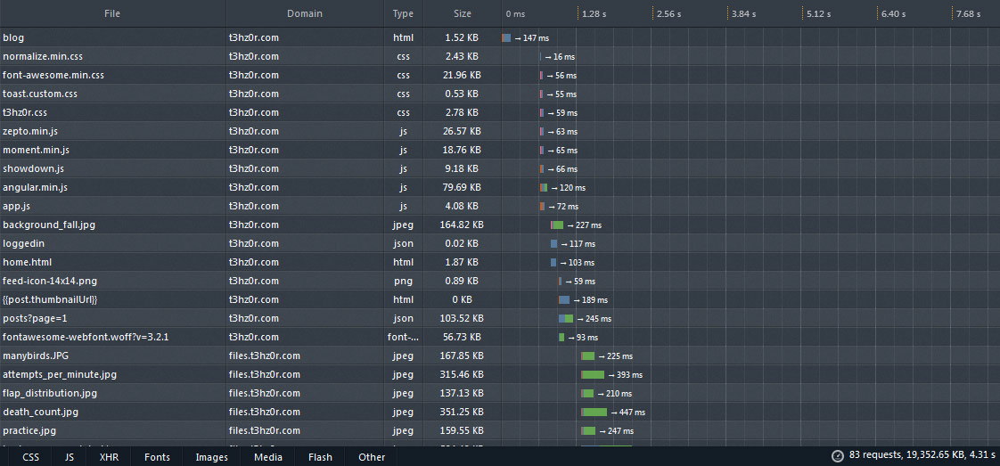
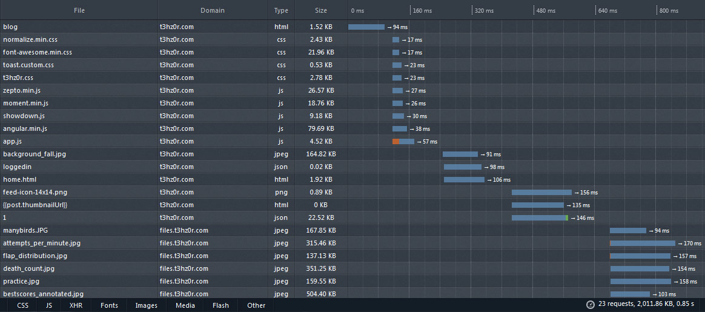

Because the front page of my blog displays full post content, and my posts tend to be content-heavy (images, video, gifs), page load times can be long. Visitors might not even scroll down to read all 10 posts per page, but they still incur the cost of loading them. It took me 4.31 seconds to finish loading my homepage, and it was noticeably slow to respond to scrolling during this time. It's especially bad for first-time visitors who don't have anything cached.

To improve the experience, I implemented dynamic loading so that when you first visit the page only the first 2 posts are loaded in full and the rest are loaded in "skeleton" form, with just their header information and no content. Scrolling down triggers further requests to retrieve the text for those posts. Credit to korpe for this `scroll-trigger` [angular.js directive](http://stackoverflow.com/a/20456388):

```js
app.directive('scrollTrigger', function($window) {
  return {
    link : function(scope, element, attrs) {
      var offset = parseInt(attrs.threshold) || 0;
      var e = $(element[0]);
      angular.element(document).bind("scroll", function() {
        if (document.body.scrollTop + $window.innerHeight + offset > e.offset().top) {
          scope.$apply(attrs.scrollTrigger);
        }
      });
    }
  };
});
```

When applied to my post tags, it calls `dynamicLoad(post)` when the article comes into view.
```html
<article class="post" ng-repeat="post in posts" scroll-trigger="dynamicLoad(post)">
 ...
</article>
```

In the controller for my homepage, the `dynamicLoad` function queries the full post from the backend and assigns its text to the one in scope:
```js
function BlogCtrl($scope, $routeParams, $rootScope) {

  //...

  $scope.dynamicLoad = function(post) {
    if (!post.text) {
      $.get("/api/posts/" + post._id, function(data) {
        post.text = data.text;
      });
    }
  };
}
```

## Before
**83 Requests, 19 MB, 4.31s**


## After
**23 Requests, 2 MB, 0.85s**

