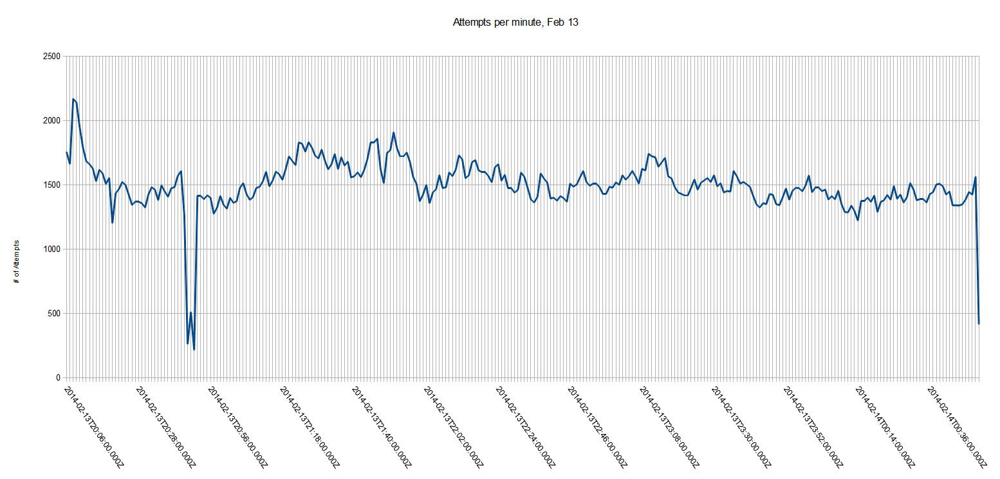
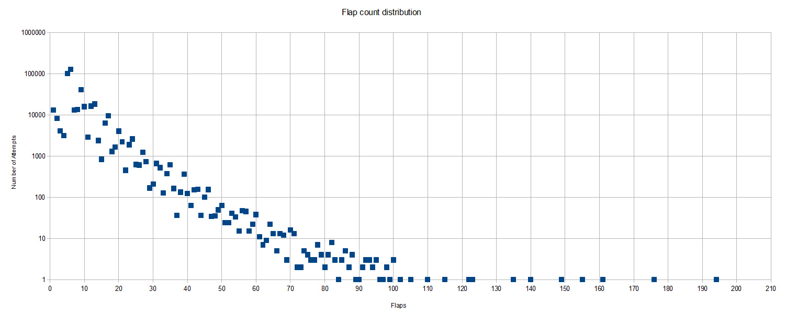

# Analysis of 419,000 FlapMMO attempts
<time>2014-02-15</time>

FlapMMO is a new and popular browser game inspired by Flappy Bird. Unlike Flappy Bird, though, each server has hundreds of other players and you can all see each other. It's lots of fun and I previously posted about [hacking FlapMMO for mouse control](/post/hacking-flapmmo-mouse-control).

When the game's developer started making changes to how data is sent between players, there was a short time that the client saw this:


Of course, this isn't how the game looks or behaves now, but it was pretty hilarious and got me thinking about collecting and analyzing player data. Before the update, your bird's XY coordinates were sent to the server every 50 ms and relayed to other players. After the update, the game no longer trusts the client with coordinates and instead the client sends a list of jumps/flaps made by the player during the attempt. This means the attempts of other players are no longer seen in real time, but rather you see "recordings" instead. Birds don't interact with each other, so they don't need to be real time anyway.

## Collection
When the client receives a message on the websocket, it decides what type of message it is by the first byte. One case constructs birds from the packet of information and adds them to the game state. To log this information, I added a few lines to the game's javascript to post these new birds to a local node server:

```js
//for each new bird, d
var request = new XMLHttpRequest();
request.open("POST", "http://localhost:3000");
request.setRequestHeader("Content-Type", "application/json;charset=UTF-8");
request.send(JSON.stringify(d));
```

The node server isn't terribly interesting; it just adds a timestamp to the request body and dumps it into a mongo collection. The only tricky part was getting around the cross-domain request problem. The node server needs to respond with the following headers for OPTIONS requests:

```js
res.setHeader("Access-Control-Allow-Origin", "http://flapmmo.com");
res.setHeader("Access-Control-Allow-Methods", "POST");
res.setHeader("Access-Control-Allow-Headers", "Content-Type");
```

I left the game open in the browser for over 4 hours and logged all the attempts other players were making (mostly on game server #6). I ended up with about 419,000 logged attempts that look like this (excluding the date field):

```json
{
  "id": 113534343,
  "x": 100,
  "y": 50,
  "vx": 2,
  "vy": 0,
  "jumps": [1, 45, 101, 139, 175, 213, 257, 299, 341, 378, 435, 464, 503, 541, 574, 611],
  "playbackTime": 0,
  "gameOver": false,
  "removeTimer": -1,
  "seed": 1011.853438986931,
  "nick": ""
}
```

## Analysis
### Attempts per minute
[](attempts_per_minute.jpg)
Overall, lots of traffic but no huge changes over the period I logged. The gap comes from me switching servers. I would have logged a bit longer, but I wasn't home to fix the logger when it stopped working (incompatibility with server-side changes by the developer?)

### Flap count distribution
[](flap_distribution.jpg)
Since each attempt logged has a list of jumps/flaps, I counted how many attempts had a jump list of length X. It's a rough analogue for how well they did because more flaps = you went further. Note that the Y axis is log scaled. If you plotted a line through the points you might conclude that only 1 in 10 people can survive another 20 flaps, and that in the order of 1 in 100,000 people survive past 100 flaps.

### Death count by time progressed
[](death_count.jpg)
Jumps are recorded by frame count from the start of the attempt. If you look at the last jump in each attempt's jump list, you'll see the last jump the player made before the attempt ended. The player progresses at a constant rate, and the frame/update rate is also a constant 60 FPS, so this is a good analogue for distance traveled or time survived. I created buckets of 10 frames and counted how many attempts ended within those buckets (log scale). You can easily see the pattern of pipes through the data (the background image is not the actual pipes for the data recorded, just an example).

The tops of the hills have interesting shapes because it depends on the phase shifts between jumping period and pipe distance. Another interesting feature is the spike in the gap after the hill at 15 seconds. The fact that many people had their last flap in that gap means that the gap was particularly hard to navigate, such as when there's a large elevation change.

### Increasing score with practice
[](practice.jpg)
Next I wanted to literally visualize the learning curve and see if people got better after each attempt they made. I grouped attempts by nickname (ignoring unnamed attempts), then sorted their attempts on the timestamp I added during the collection phase. Like above, the score for an attempt was assumed to be the time of last jump. The scores were then averaged across the attempt numbers. For example, each player's second attempt scores are averaged together.

The plot does show a definite upward trend. The rate of acclimation is high in the early attempts as people figure out the game's mechanics and feeling. The line then flattens out because you're either good at this type of game or you're not, and you'll need lots of practice to improve. One reason for the increase in spread comes from reduction in sample size at the higher attempt numbers since most people won't try hundreds of attempts. Another reason is that names with lots of attempts could simply be common names that lots of people choose and thus would represent a variety of players with different skill levels. Also, since people learn at different rates the variance becomes more pronounced after more attempts. There are names with over 1000 attempts, but I cropped out much of the plot since it was meaningless.

### Best scores per player
[](bestscores_annotated.jpg)
I wanted another way to visualize how practice affected score. Each point represents a player (by name, again). The X axis is how many attempts they made during the 4+ hours I logged, and the Y axis is their best survival time accomplished in those attempts. I again cropped the plot because it gets quite spread out beyond 200 attempts per name.

This is a really cool plot because you can see how peoples' best scores form these horizontal stripes representing the pipes. Consider the *zone of colossal failure*. Players in that zone made many attempts at the game but had poor high scores for the amount of time and effort they invested playing. Conversely, the *zone of skill* shows players that only needed a few attempts to get a high score.

-------------

## Links
* **Alexis Huet** blogged about [Description and modeling of FlapMMO score data](https://ahstat.github.io/Flap-mmo/) using 100,000 newly-collected attempts and also comparing to my data set.
* *The Guardian* big data columnist **Siraj Datoo** featured my work in the article [Flappy Bird online: what does the data say?](http://www.theguardian.com/news/2014/mar/03/flappy-bird-what-does-the-data-say)

## Dataset
If you'd like to explore this data yourself, you can download it here:
* CSV: [flappy_db.csv.7z](http://files.t3hz0r.com/blog/2014/analysis-flapmmo-attempts/flappy_db.csv.7z) (13.1 MB)

The CSV package comes in two files: **attempts.csv** and **jumps.csv**. Fields in attempts.csv are attemptId, playerId, nick, seed, and date (ISO 8601 datetime UTC format). Fields in jumps.csv are attemptId, sequenceNo (0 based index), and frame. I removed the other fields shown in the Collection section of this article (like x, vy, gameOver) because they're identical for every attempt.

Thanks to @FlapMMO for letting me know that the id field (not to be confused with _id) can be used to uniquely identify players instead of relying on nickname.

If you've got any questions or comments, shoot me an [email](/about)!
