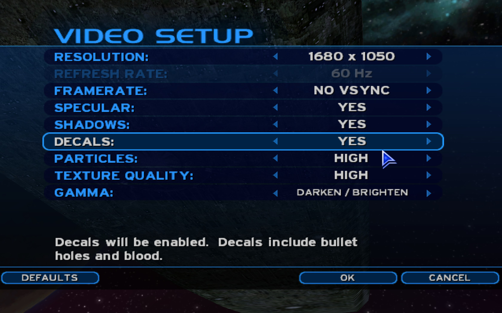
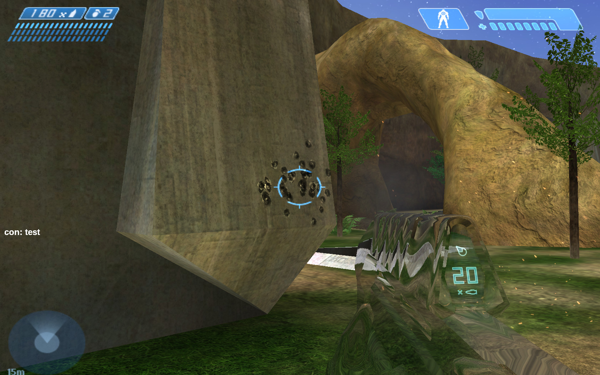

# How to run Halo Custom Edition on Linux with community mods

**Updated 2020-03-19**

I've recently gotten [Halo Custom Edition][hce] working well on my Linux desktop, so I want to document and share the process. Custom Edition is a standalone version of Halo PC (a.k.a. "retail") which supports user-created maps and an editing kit (HEK).

Setting up the HEK will not be a goal and instead I want to focus on setting up a good multiplayer experience. This will involve installing CE, updating it, and installing a few popular mods and improvements:

* Chimera 1.0: Custom map downloads, FOV and widescreen fixes, server bookmarks, plus other quality of life improvements
* CE Refined: multiplayer and campaign maps rebuilt with a tagset which restores the correct Xbox appearance lost during the game's PC port
* DXVK: Implements DirectX 9 over Vulkan for increased framerates

Make sure you have your Halo PC product key ready. You'll need it to install CE later. I'll be referencing some Arch linux specifics, but distro shouldn't really matter so just substitute the equivalents from yours.

## System requirements

First off, it's a good idea to start with an up-to-date system and take advantage of any bug fixes and optimizations. For Arch, run `sudo pacman -Syu`. For graphics, I found the best performance and stability running Xorg with the proprietary Nvidia Linux drivers for my 660ti. Following the [Arch wiki][nvidia], I installed:

```sh
sudo pacman -S nvidia nvidia-utils nvidia-settings
```

I found that the [nouveau][] drivers and mesa gave poor framerates compared to the nvidia driver. I also tried using wlroots-based Wayland window managers (like [sway][] and [way-cooler][]) instead of Xorg and experienced lower framerates and frequent crashes requiring restart, so I can't recommend that approach either unless it's otherwise already stable and performant on your system.

## Creating a Wine prefix

Next, install [Wine][wine] and Winetricks. To get ingame sound working, I needed to install some audio libraries too. I don't know if _all_ these libraries are needed since I gathered the list from a few google results, but it doesn't hurt to install them. You could try only installing Wine and Winetricks in this step and seeing if sound works first.

```sh
sudo pacman -S wine winetricks openal libpulse alsa-plugins mpg123 alsa-lib
```

Now configure a Wine prefix. This is a directory where the Windows system and its "C drive" will be installed. A default wine prefix will be used if you don't specify one, but if you want to isolate applications running under Wine it can be helpful to set a prefix by environment variable.

```sh
export WINEPREFIX=/home/<you>/wine-prefixes/halo
wineboot
```

It will be necessary to set this environment variable any time you are running Wine and want to use this prefix (e.g. from a new shell). During `wineboot` you may be prompted to install Mono and Gecko. You can cancel these since they're not needed (or set `WINEDLLOVERRIDES=mscoree=d;mshtml=d` to avoid being prompted).

## Installing Halo

Download the CE installer ([mirror 1][hce-download], [mirror 2][download-3]) and the official 1.0.10 patch ([mirror 1][patch-download], [mirror 2][patch-download-2], [mirror 3][download-3]). With the same Wine prefix configured, run:

```sh
# needed by Halo's PidGen.dll to generate a product ID from CD key
winetricks mfc42

# if not installed, multiplayer chat messages will not show up ingame
winetricks msxml4

# install and patch the game
wine halocesetup_en_1.00.exe
wine haloce-patch-1.0.10.exe
```

If for whatever reason the msxml4 installer doesn't work, you can always use Wine to run the installer which ships in Halo's `/redist` directory.

During the CE installer, you will be asked for your retail product key. You do not need to install Gamespy arcade, install for all users, or create a desktop icon. Don't click "Play Now" just yet; close the installer and move on to patching the game. When that's done, I suggest making a start script for the game to make it easier to run:

```sh
#!/bin/bash
export WINEDEBUG=-all
export WINEPREFIX=/home/<you>/wine-prefixes/halo
HALO_HOME="$WINEPREFIX/drive_c/Program Files (x86)/Microsoft Games/Halo Custom Edition"
HALO_OPTS="-console -screenshot"
cd "$HALO_HOME"
nohup wine haloce.exe $HALO_OPTS &
```

The `WINEDEBUG=-all` variable noticeably improved performance for me during multiplayer matches with a lot of players. You should also set the `$HALO_HOME` variable in your shell because you'll need it later during this guide.

Hopefully the game runs, and you're greeted with the menu music if the audio is working correctly. Head to the video settings and bump the resolution up to your native resolution if available and set framerate to "NO VSYNC". Don't worry about vertical tearing or if your native resolution was not an option; we'll use a mod later to address this. It is not recommended to use Halo's `-vidmode <width>,<height>,<refresh>` argument or built-in Vsync as it introduces input latency.



While you're in the settings menu, also head over to sound options and set quality to HIGH.

Start a LAN match on _Beaver Creek_ and test the following:

* Chat messages are visible (you should see a "welcome \<name\>" message when you join")
* Pick up the active camo powerup and make sure the shader looks correct. If it's just semitransparent rather than refractive, your graphics card is probably not recognized by the game. Obtain its PCI device ID (for Nvidia, shown in `nvidia-settings`) and add it to the vendor's section of `$HALO_HOME/config.txt`. More details can be found in [OpenCarnage.net's guide][pc-guide]
* Sounds are working correctly -- if not you may need to make CE recognize your sound card by adding its device ID to the relevant `$HALO_HOME/config.txt` section. Again, [more details here][pc-guide]
* Bullet decals should appear. Halo doesn't create a decal for the first bullet fired in a game, so fire a couple! If the decals do not appear, double check the decals option in the game's video settings
* Grenades should produce particles and weapons should produce muzzle flash. If not, there may be an issue rendering certain transparent shader types. I had this issue, but am unsure of the root cause because a new wine prefix and updated nvidia driver resolved it
* Hit Ctrl + F12 to see a framerate counter. The framerate should not be capped at 30 or 60, and on modern hardware it should be in the hundreds
* Mouse input feels smooth and responsive. You may need to strike a balance between DPI on your mouse and ingame sensitivity options

The field of view will be too narrow if you are using a widescreen display. No worries, we'll fix that later.



## Installing Chimera

**Prior to 2020-03-19 This guide previously recommended installing the HAC2 mod for its automatic custom map download feature. Chimera 1.0 now implements this feature, so for a simpler setup I suggest just sticking with Chimera only.**

Chimera is a mod which further enhances the Halo client. It is not compatible with HAC2 or OpenSauce. It can be downloaded from the [official development thread][chimera] and replaces the `strings.dll` file in your Halo CE install directory:

```sh
# download and extract Chimera
curl "https://opencarnage.net/applications/core/interface/file/attachment.php?id=1050" --output chimera.7z
7z x chimera.7z
# back up your existing strings DLL
mv "$HALO_HOME/strings.dll" "$HALO_HOME/strings.dll.bak"
# install the Chimera strings DLL
mv strings.dll "$HALO_HOME"
# install chimera's default config
mv chimera.ini "$HALO_HOME"
```

Chimera now needs to be configured. In short you need to:

1. Edit the `chimera.ini` file installed above. This lets you configure Halo's resolution, set up hotkeys, and adjust chat message locations
2. Issue commands through the ingame console to further configure Chimera. These are saved to `~/My\ Games/Halo\ CE/chimera/preferences.txt` if you haven't otherwise configured your wine prefix

The ingame commands are well documented in Chimera's `README.md`. To change a preference, type the command into the ingame console by pressing the tilde (~) key. Changes should be immediately saved and applied ingame. Some preferences I recommend are:

```
chimera_block_buffering 1
chimera_block_camera_shake 1
chimera_block_gametype_indicator 1
chimera_block_gametype_rules 1
chimera_block_hold_f1 1
chimera_block_loading_screen 1
chimera_block_zoom_blur 1
chimera_block_mouse_acceleration 1
chimera_fov 90
chimera_auto_center 2
chimera_devmode true
chimera_enable_console 1
chimera_widescreen_fix 1
chimera_af 1
chimera_interpolate 1
chimera_uncap_cinematic true
```

## DXVK
At this point, you may not be satisfied with framerates. Using winetricks to install native d3d9 can improve framerates a bit, but I highly recommend using [DXVK](https://github.com/doitsujin/dxvk/) to get the best performance. It installs "native" direct X DLLs to your wine prefix which are backed by Vulkan and your graphics drivers rather than wine's built-in D3D-over-OpenGL implementation. DXVK has been specifically tested and patched for Halo CE among other games, so the experience is great.

You will firstly need to update and install your graphics driver and Vulkan ICD loader (32 bit included, even if you're using a 64 bit wine prefix):

```sh
sudo pacman -S nvidia nvidia-utils lib32-nvidia-utils nvidia-settings vulkan-icd-loader lib32-vulkan-icd-loader
```

Next, grab the latest [DXVK release](https://github.com/doitsujin/dxvk/releases), extract its tarball, and run:

```sh
# set the wine prefix if it's not already set
export WINEPREFIX=<your halo wine prefix>
./setup_dxvk.sh install
```

This copies the DXVK d3d DLLs to your prefix's `system32` and `syswow64` directories. Next, use `winecfg` to ensure these DLLs are actually being used:


Ensure that d3d9 is in **native** mode, not built-in. If you have also installed the HEK in this wine prefix, note that **Sapien does not yet work under DXVK** and you will need to switch to built-in mode when you want to use it.

## Refined stock maps

The [Halo CE Refined project][refined] by Moses, Jesse, and Vaporeon is a rebuild of all stock campaign and multiplayer maps with the refined tagset which faithfully reproduces the classic Xbox visuals and fixes issues introduced in the port to PC by Gearbox. It also includes higher resolution HUD elements. Download the newest versions here:

* [Refined singleplayer][refined-sp-1] (1.3 GB) ([mirror][refined-sp-2])
* [Refined multiplayer][refined-mp] (37 MB)
* [Refined UI][refined-ui] (820 KB)

Once these archives have been downloaded, extract all `.map` files to `$HALO_HOME/maps`. Overwrite or backup the existing multiplayer and UI maps. The refined multiplayer maps above have forged checksums which allows them to be used in multiplayer. The UI map restores the Halo ring shader and adds a singleplayer menu to Custom Edition so you can load the refined SP maps without having to use the console.


_Refined Bloog Gulch, showing the fixed teleporter shader and high resolution HUD (split screen version)_


_Refined Assault on the Control Room mission, showing fixed jackal shield and Assault Rifle shaders._

## Downloading custom maps

Custom maps can be downloaded by joining dedicated servers, or by downloading them from popular release sites:

* [Halomaps.org](http://halomaps.org/)
* [Halo CE3](https://haloce3.com/)

## Tweaks

Halo has a built-in lisp-like scripting language which is used in its campaign maps, HEK console, and the ingame console. It supports a huge number of commands for which you can find [semi-complete references online][halo-scripts]. Halo will automatically run any commands present in `$HALO_HOME/init.txt` at startup, so you can use this to quickly launch into a map or setup preferences. For example, I set `multiplayer_hit_sound_volume 1` to increase the volume of the "ping" sound made when damage is dealt in multiplayer.

Unfortunately, enabling MSAA in the `nvidia-settings` control panel resulted in a black screen for Halo. FXAA worked.

---

I hope this has been a useful guide for you. If you have any questions or suggestions, please [get in touch](/about). See you ingame!

[wine]: https://www.winehq.org/
[hce]: https://www.halopedia.org/Halo_Custom_Edition
[nouveau]: https://nouveau.freedesktop.org/wiki/
[nvidia]: https://wiki.archlinux.org/index.php/NVIDIA
[sway]: http://swaywm.org/
[way-cooler]: https://github.com/way-cooler/way-cooler
[hce-download]: http://hce.halomaps.org/index.cfm?fid=410
[patch-download]: https://www.bungie.net/en/Forums/Post/64943622?page=0&path=0
[patch-download-2]: http://hce.halomaps.org/index.cfm?fid=6798
[download-3]: http://vaporeon.io/hosted/halo/original_files/
[pc-guide]: https://opencarnage.net/index.php?/topic/7383-the-halo-ce-ultimate-enhancement-guide-updated-260319/
[os]: https://www.halopedia.org/OpenSauce
[spv3]: https://www.reddit.com/r/halospv3/
[os-trailer]: https://www.youtube.com/watch?v=TTDaVb19_PQ
[hac2]: http://198.98.120.174/index.html
[hac2-mirror]: http://blog.haloanticheat.com/
[chimera]: https://opencarnage.net/index.php?/topic/6916-chimera-10-beta/
[halo-scripts]: https://andrew.gg/scripts/00reference.html
[refined]: https://www.reddit.com/r/HaloCERefined/
[refined-mirror]: http://vaporeon.io/halo-refined/
[refined-sp-1]: https://www.reddit.com/r/HaloCERefined/comments/9l9ujl/downloads/
[refined-sp-2]: https://haloce3.com/downloads/singleplayer/modified-singleplayer/refined-halo-1-singleplayer-maps/
[refined-mp]: http://vaporeon.io/hosted/halo/archives/haloce_mp_semirefined_r13_en.7z
[refined-ui]: http://vaporeon.io/hosted/halo/archives/haloce_stock_ui_fixed_v3.7z
