

_[More screenshots below](#screenshots)_

_Alpine_ is a Halo Custom Edition map I built over the course of 2020. The pandemic gave me a lot of time to catch up with the Halo CE modding community, and I found there was a growing buzz of activity. This inspired me to dust off the ol' [_Halo Editing Kit_](https://c20.reclaimers.net/h1/tools/hek/) (HEK) and try making a map again.

## Download
You can download _Alpine_ (and its sources) here:
* https://github.com/csauve/alpine
* https://opencarnage.net/index.php?/topic/8223-alpine/
* https://t3hz0r-files.s3.amazonaws.com/halo/releases/alpine/alpine.zip

Also check out [Vaporeon's fork](https://github.com/Vaporeon/alpine) with 32 bit lightmaps.

## The making of _Alpine_
At the start of the project, I was using a Linux desktop primarily and had gotten [Halo running on it](/post/halo-ce-on-linux/). While the HEK ran fine in Wine, I really wanted to avoid having to reboot into Windows for other software. A new [Blender](https://www.blender.org/) addon for exporting Halo models (thanks to [General-101](https://github.com/General-101)) made Blender a viable free alternative to 3ds Max, and that after trying both [Krita](https://krita.org/en/) and [GIMP](https://www.gimp.org/), I settled on Krita to replace Photoshop since it felt more intuitive to me.

### Early prototyping
All my maps begin with a sketch. I use it to quickly get a layout visualized and iterate before modeling starts. The initial concept ended up being only half the final play space, but I was already interested in having an asymmetric layout with steep outdoor elevation changes like the map [Mudslide](http://hce.halomaps.org/index.cfm?fid=528).

The sketch roughly shows a desire for mixed indoor/outdoor gameplay, with the opportunity for vehicles to even come indoors for some typical Halo sandbox antics. I set about modeling the layout at a low amount of detail, while also starting to explore some of the _Forerunner_ architectural designs of blue base:

[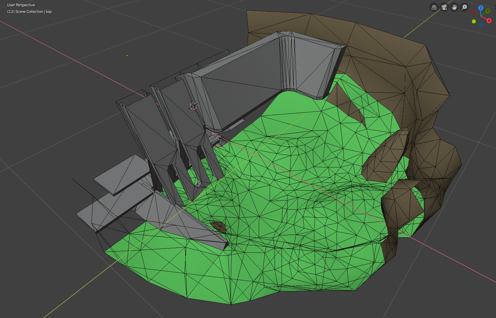](pics/model1.png)

Early on, I found that a tall narrow tower akin to the one in [Relic](https://halo.fandom.com/wiki/Relic_(level)) made for an interesting sight even if it existed above the playable space.

[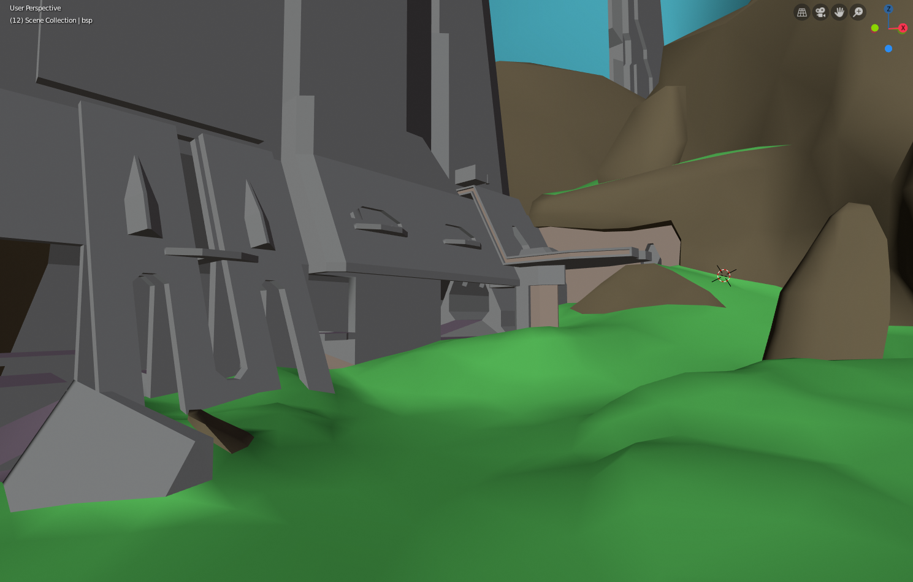](pics/model7.png)

At this point, I had already begin changing the indoor layout as I struggled to balance an in-universe purpose for the facility, fair CTF gameplay, and architectural appearance. The modeling churn burnt me out a bit, so I walled off the downhill part of the map and got it in-game. This was for the best anyway, as I found the map to be woefully small for the kind of vehicle antics I wanted. Getting the map in-game early helped me discover that it needed big changes, so I set about expanding the layout... but into _what_?

### Playspace expansion
Something I love about Bungie's original campaign levels for Halo CE is that the outdoor spaces feel expansive and grounded. There's an abundance of open spaces, towering natural and artificial structures that draw your eye upwards, and detailed skyboxes that make the level feel like it belongs _somewhere_ on the vast ring. They feel like plausible locations rather than sealed-off bubble universes.

I wanted the same feeling for _Alpine_, since it's something multiplayer maps often overlook. I was inspired by the popular map [Portent](http://hce.halomaps.org/index.cfm?fid=1796), which gave me the same feeling of awe as the campaign locations. To ground _Alpine_ in a broader space, I created large mountains outside the playable space. These began with simple block-outs which I built in stratified layers. During a recent trip to [Red Rock Canyon, Nevada][rrc], I had seen massive upheaved layers of Earth exposed across the valley. This image stuck in my mind and I wanted to replicate the feeling of geological age, especially in the context of Halo's ancient _Forerunner_ facilities.

[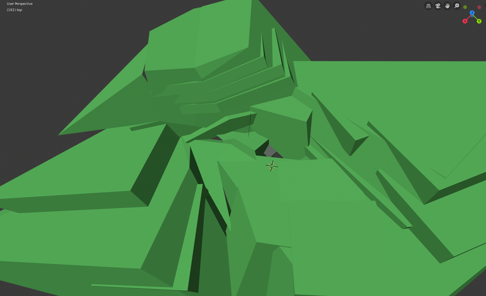](pics/model15.png)

With the rough overall shape of the mountains established, I began to retopologize over them and work on an expanded layout:

[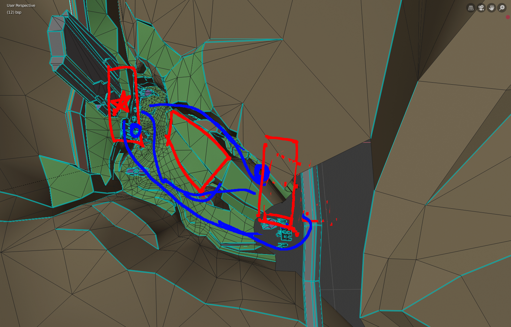](pics/layout2.png)

While I wasn't quite sure what the other team's base would look like yet, I picked a rough spot for it and considered some paths that each team might take during a CTF match. One of Halo's multiplayer pillars is the need to make choices:

* Should I exchange this weapon given what my enemy might have?
* What path do I take? Is it safe?
* Is it worth the risk to get that powerup?
* Should I throw this grenade now or save it?

Despite the relatively simple set of elements in its sandbox, the combination of them and the map itself mean they are constantly making choices. For me, a fun map is one that continuously offers me choices and forces me to consider risks and rewards--an ongoing gamble that also requires skillful execution.

Beyond this, I had some other gameplay goals for this map:

* Mixed indoor and outdoor gameplay and asymmetry to lend variety.
* Areas where vehicles or players can dominate, but also plenty of interaction between their paths.
* Flag captures must not be too easy by vehicle, and a defending team which reacts well should have a chance to recover the flag.
* Create defendable power positions like _Blood Gulch's_ central hill, as this seems to scratch an itch for players who just want to fight over a hill. All such positions should have a counter-position, though.
* Fun to drive vehicles on: lots of jumps, indoor driving, opportunities to splatter those on foot, and skillful navigation of uneven terrain.

To help accomplish these goals, the path between bases was split into a tight canyon suitable for foot traffic, and a longer vehicle path which pass through a contested power position hill in the middle of the map. The canyon path was meant to be the fastest but also high risk, especially to vehicles, because of the lack of room to maneuver and escape grenades. Players who took the other path would have to contend with vehicles, but also had a defensible hill position to rely on. This was all guess work because I didn't have the map in-game nor enough play testers to really see if I was right.

Red team's base was modeled as a sort of retaining wall or lattice structure protruding from the cliff face with platforms, evoking _The Silent Cartographer_ and hinting that the entire landscape might be engineered despite its fractured and weathered appearance.

[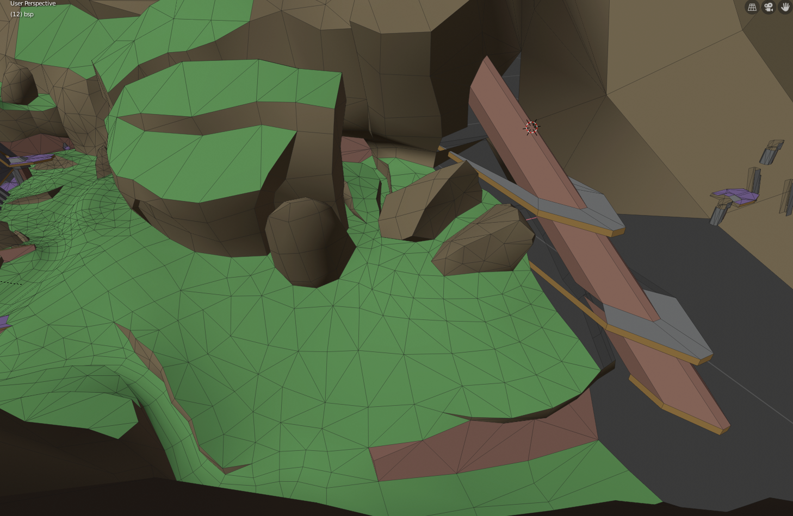](pics/downhill.png)

On the other hand, blue team's base was in a far more refined state since it had been iterated on since modeling began. The lower roadway offers a way for vehicles to come right into the base, but the raised platforms above and predictable exits give defenders a good chance to take out the vehicle.

### Layout refinement
Next, red base in general felt very lackluster compared to blue. It was too steep to easily drive vehicles around, and the second platform wasn't necessary. I made the terrain around the base more flat and inviting, and a nearby waterfall pool was added to give vehicles some breathing space for approaching the base. The large boulders from the collapsed cliff face were adjusted to serve as vehicle ramps if the player was skilled enough and wanted to take the risk of flipping.

Probably the biggest change, though, was the addition of a third central structure.

[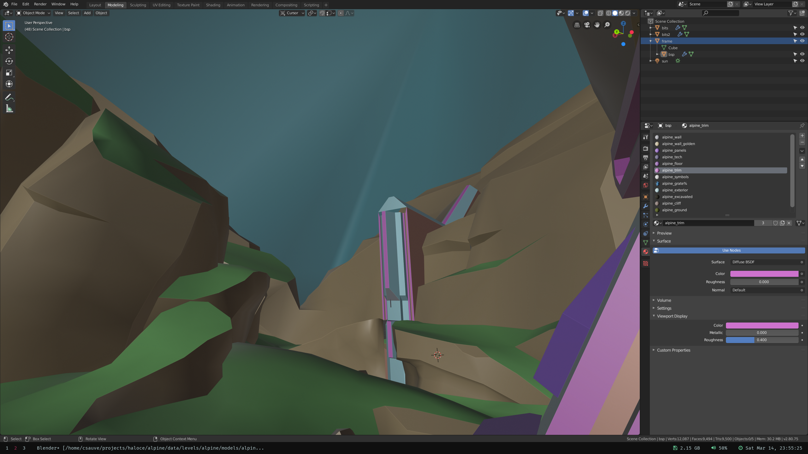](pics/alpine_tmp_000.png)
[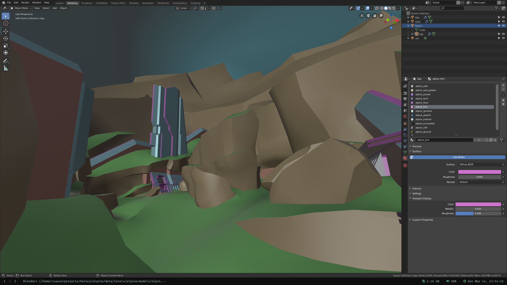](pics/alpine_tmp.png)

I suspected that players might not venture into the lowest parts of the outdoor space, but rather stay near the central hill and rocks for the cover they provided and short walking distance. The downhill space felt wasted if only vehicles were going to use it.

In order to encourage players to visit it, the third structure would house the rocket launcher and overshield powerup, and came with raised pathways from each team's teleporter exit so they would naturally want to move to the structure.

However, this new raised space had a dominating view of the center of the map. While the bases are out of pistol range, I thought camping of the middle area might become an issue. This led to the addition of a second raised pathway _opposite_ the central structure, seen on the far right in the below screenshot:

Likewise, the opposing raised path (which _was_ in pistol range of the bases) was given little cover so that campers could be easily harassed by defenders who took the teleporter towards the central structure.

Inside the central structure, I recreated a spiral ramp from _The Silent Cartographer_ campaign mission which would allow players to move between the raised path and the ground, house items, and serve as the drainage point for all the map's waterfalls and rivers.

The final major layout change was connecting the narrow canyon path with the raised opposing path mentioned earlier by adding a tunnel. This allows players to make more choices as they cross the map, and provided a convenient escape for vehicles which attempt to pass through the canyon after I added a sunken area to block them. I modeled the tunnel in such a way that the central structure is visible from the bottom. Maybe this helps orient players, but mainly it just looks cooler.

I also found that it was a lot of fun to drive a vehicle up through this tunnel and off the cliff top, so made sure that path was part of the map's _Race_ gamemode track.

### Texturing, lighting, and finishing touches
While I had been giving the map some basic UV unwraps and textures while modeling each new area, I knew the layout was subject to change so avoided the majority of texturing until a final phase.

Again, it was important to me that _Alpine_ felt like a real place. With a gloomy, rainy atmosphere and a number of rivers in the map, I really wanted to sell the ideal that this mountain valley was a watershed with drainage patterns visible throughout. To accomplish this, I decided to extend the map's ground texture to include parts of the surrounding mountains as well. This would give me the ability to paint details into the mountains, but it also meant I would be sacrificing some UV space in the ground texture.

Luckily, that wasn't too much of a concern since Halo ground textures are typically low resolution and rely on blended tiling detail maps to add fine player-scale detail. Still, I wanted to get the most bang for my buck where it mattered so spent a lot of time unwrapping my ground surfaces:

[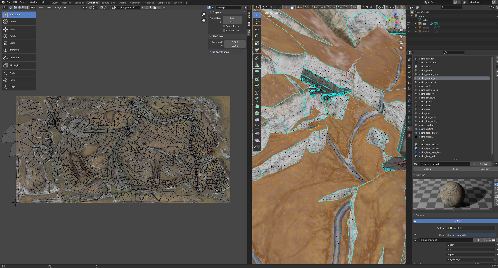](pics/Blender3.png)

To optimize texture space, I gently warped UV islands to fit tighter while avoiding too much stretch. I also scaled down the size of UV islands for the unplayable spaces they didn't require as much resolution. These faces were given a different [Halo shader](https://c20.reclaimers.net/h1/tags/shader/shader_environment/) which used the same base and detail maps, but increased the tiling of the detail maps to compensate for their lower UV resolution.

Blender's texture paint mode and Krita's brush system and tablet support were invaluable at this stage for painting the ground texture itself. I created additional custom textures for the cliffs and ground detail maps by photobashing pictures of my friend's fish tank and some old photos I took hiking.

I received feedback from fellow modders and some playtesters that the map was too dark. The soft lighting wasn't doing the geometry any favours, and after having spent so much time modeling that detail I really wanted to highlight it. I solved this problem by brightening and warming the highly directional component of the skybox's light, and adding strong directional lighting around my structures to highlight aspects of their architecture.

In particular, red base still felt less visually impressive compared to blue base's tall tower set against its mountain backdrop. I added strong red lights to the sides of the base pointing at the surrounding cliffs which washes them in red and adds a sinister visual weight to the area. Some 2D billboard trees on the surrounding hills also added some interest.

This stage of development also included the creation of _portal planes_, which define closed "cells" of the level which can have unique sound environments, and _weather polyhedra_ that mask rain particles from appearing under overhangs and indoor spaces.

[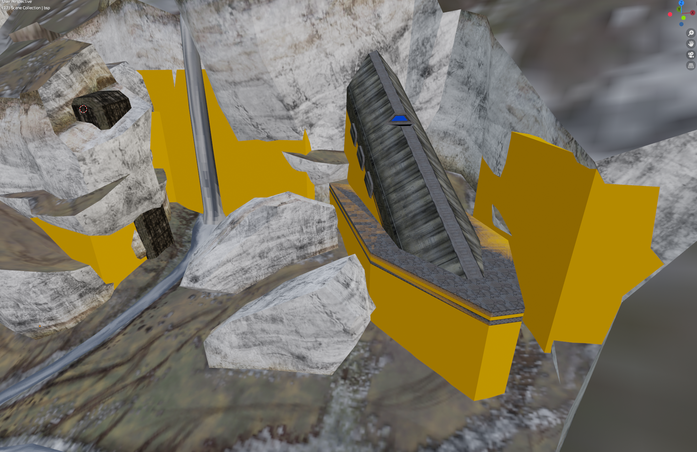](pics/weatherpoly.png)

---

<h2 id="screenshots">Completed map</h2>
I could probably go on further about this map's development because each part of it has some story; everything was purposeful and refined until I was happy with it. Although there were still a few things I would change with the map, at some point I had to just stop and feel satisfied with where I had arrived.

Most Custom Edition maps don't get played that often, but that's OK with me. I'm happy knowing it will show up in a few gamenights now and then over the coming years, and the process of creating it was creatively fulfilling and helped me reconnect with the modding community. I am very happy with how _Alpine_ turned out:

[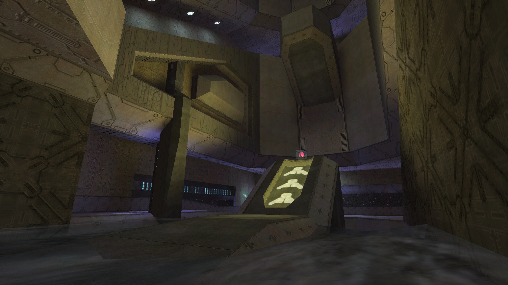](pics/57screenshot00.jpg)
[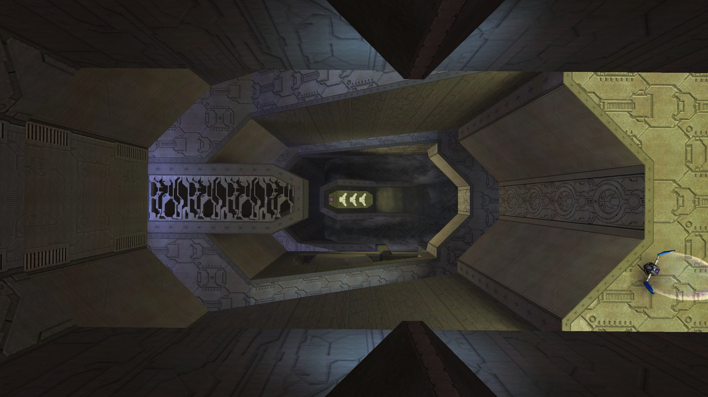](pics/58screenshot00.jpg)
[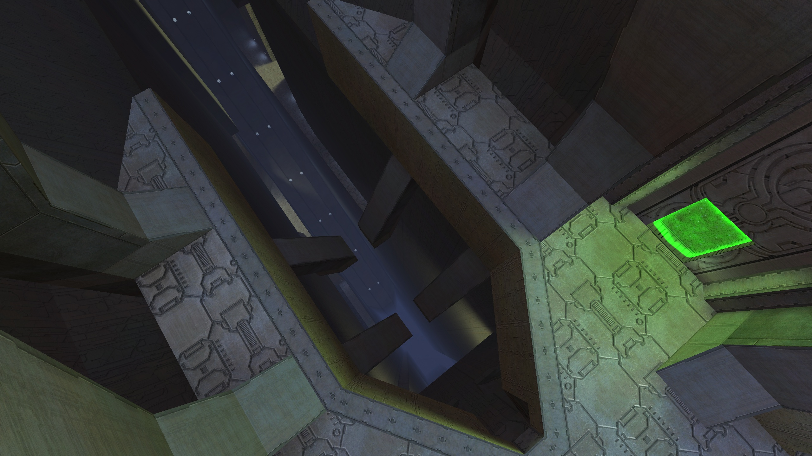](pics/26screenshot00.jpg)
[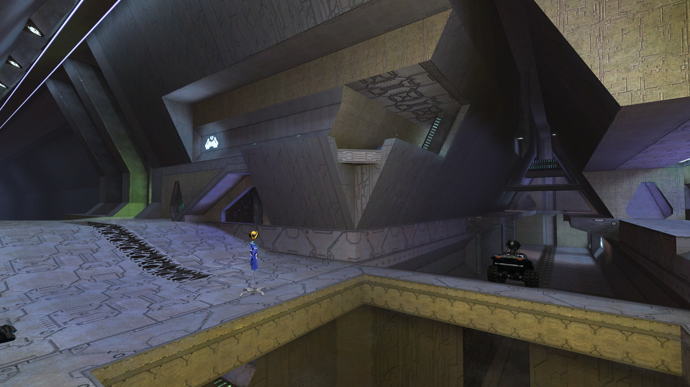](pics/20screenshot00.jpg)
[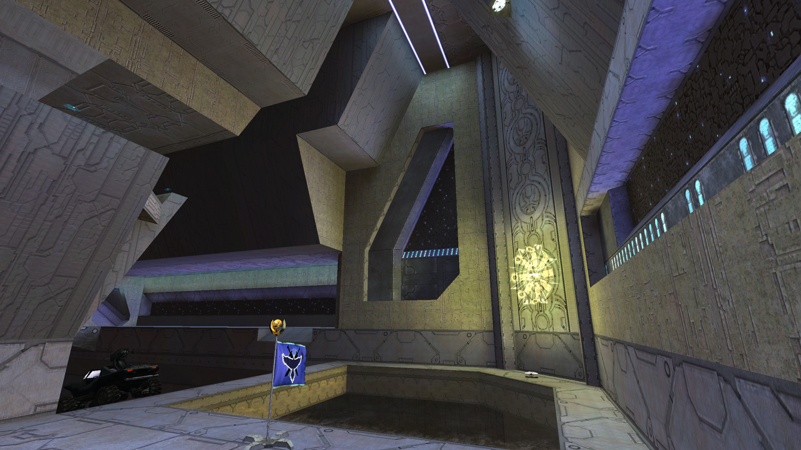](pics/30screenshot00.jpg)
[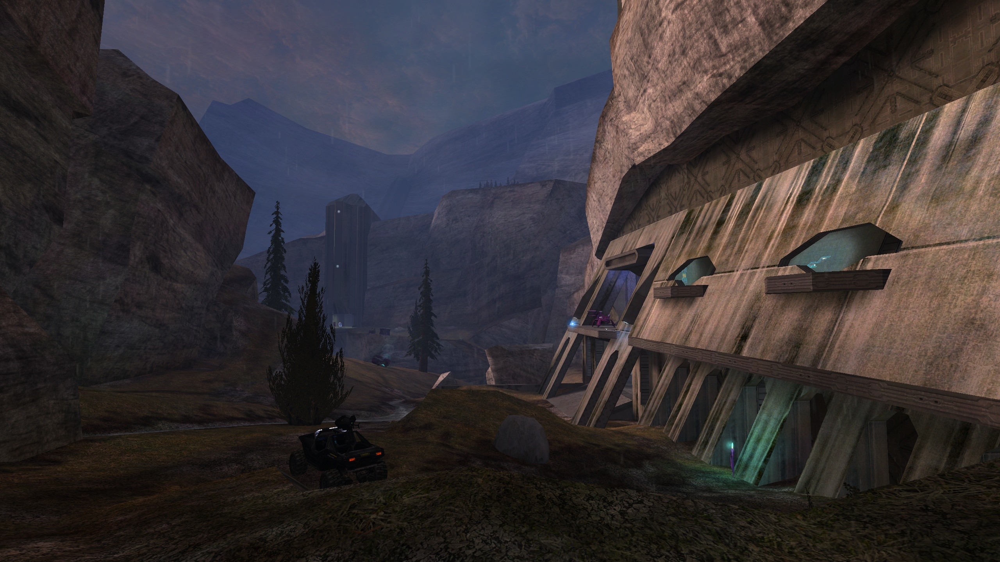](pics/34screenshot00.jpg)

[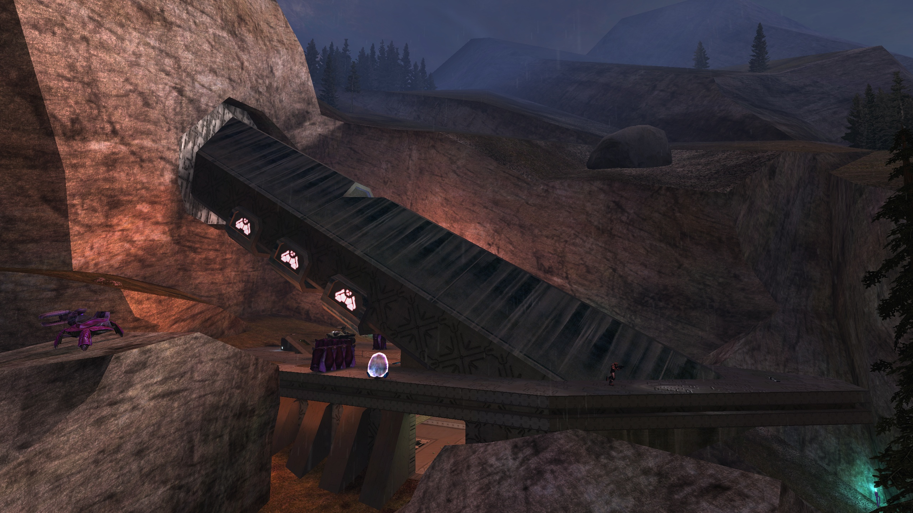](pics/74screenshot00.jpg)
[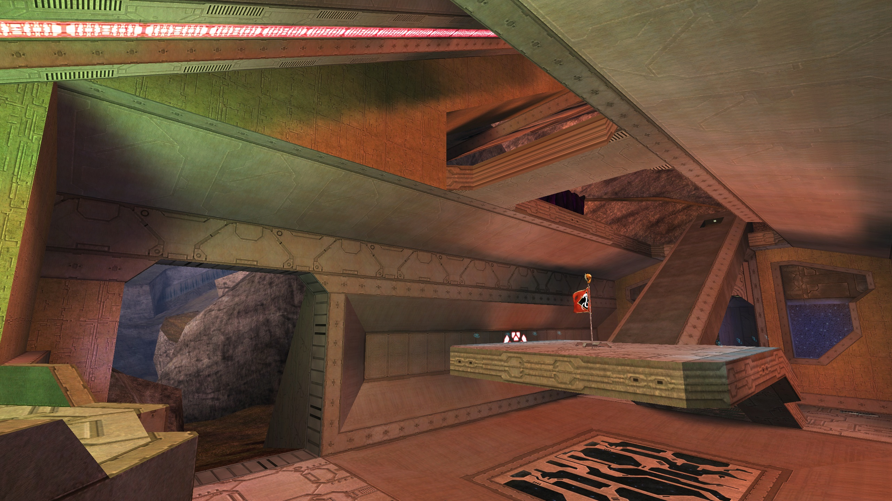](pics/88screenshot00.jpg)
[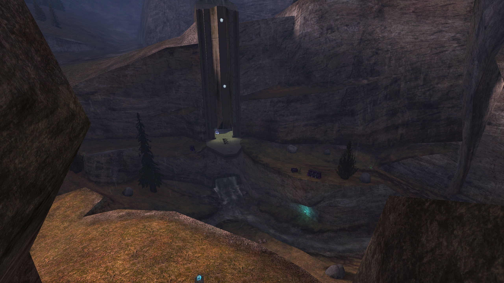](pics/49screenshot00.jpg)
[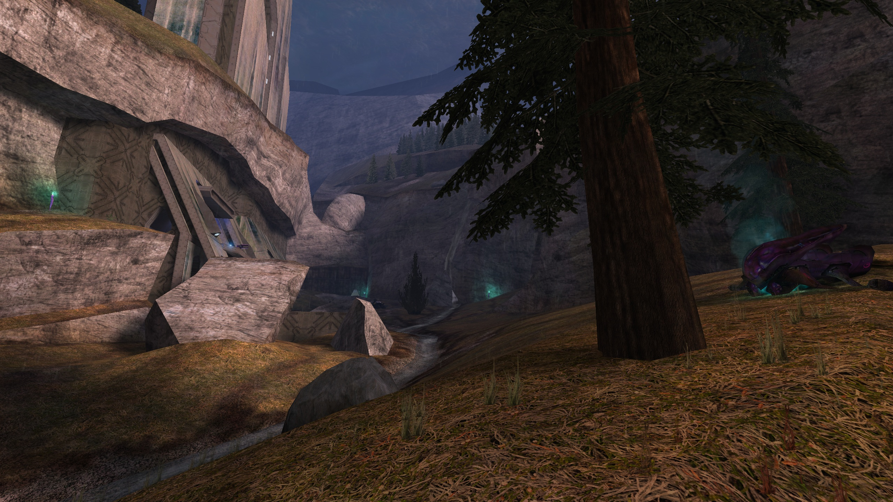](pics/52screenshot00.jpg)
[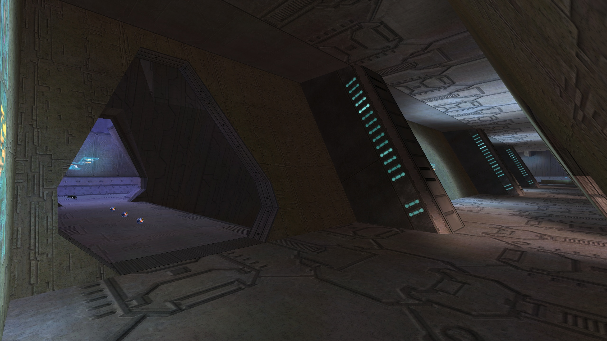](pics/10screenshot00.jpg)
[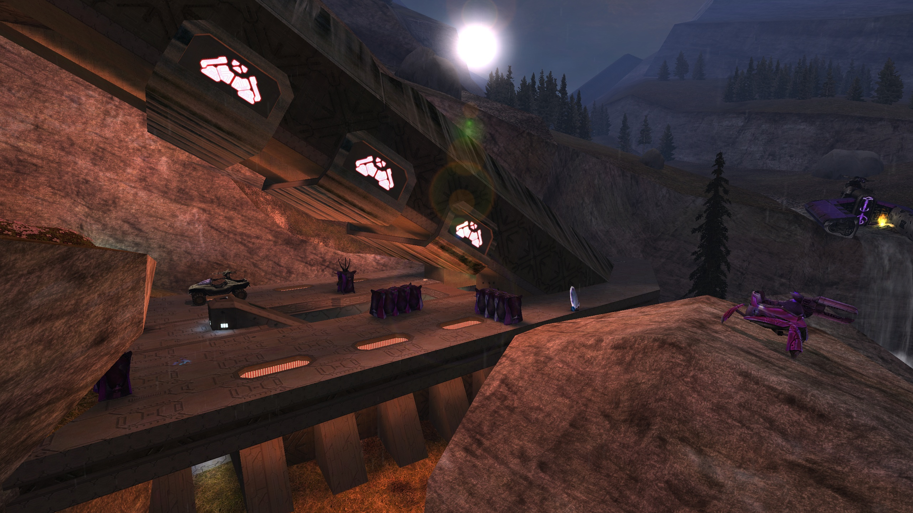](pics/84screenshot00.jpg)
[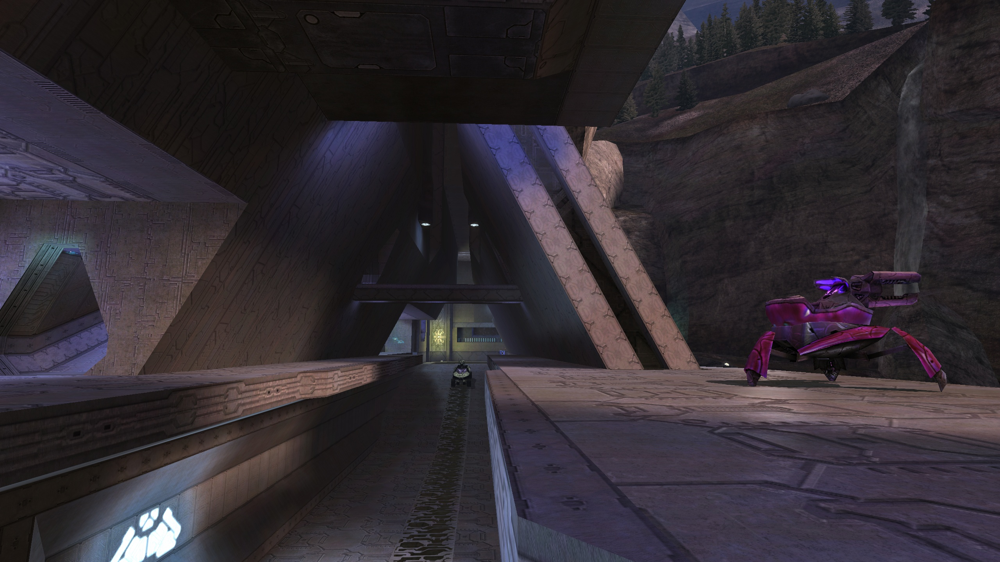](pics/8screenshot00.jpg)
[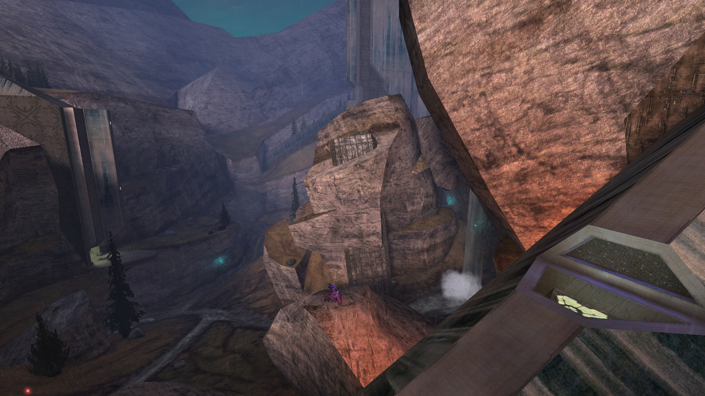](pics/98screenshot00.jpg)
[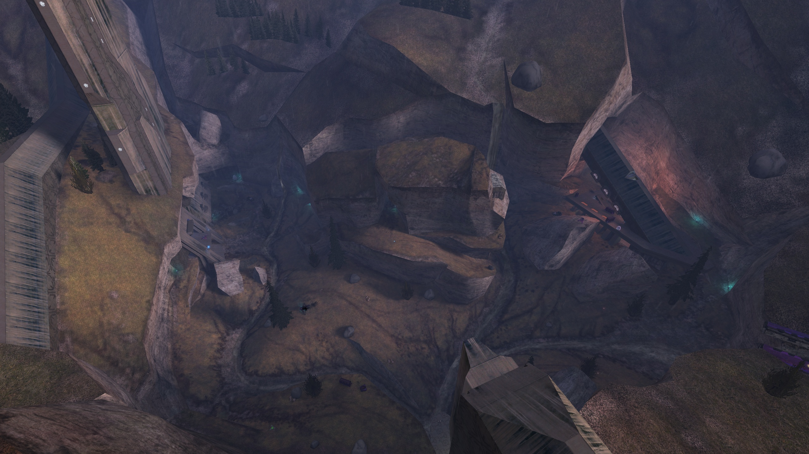](pics/92screenshot00.jpg)

[rrc]: https://en.wikipedia.org/wiki/Red_Rock_Canyon_National_Conservation_Area
