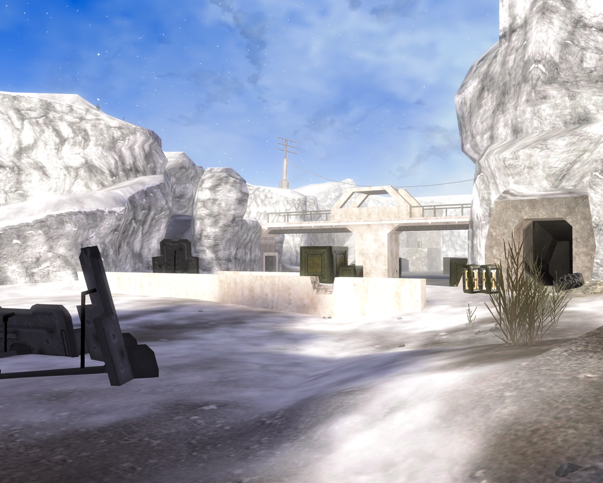
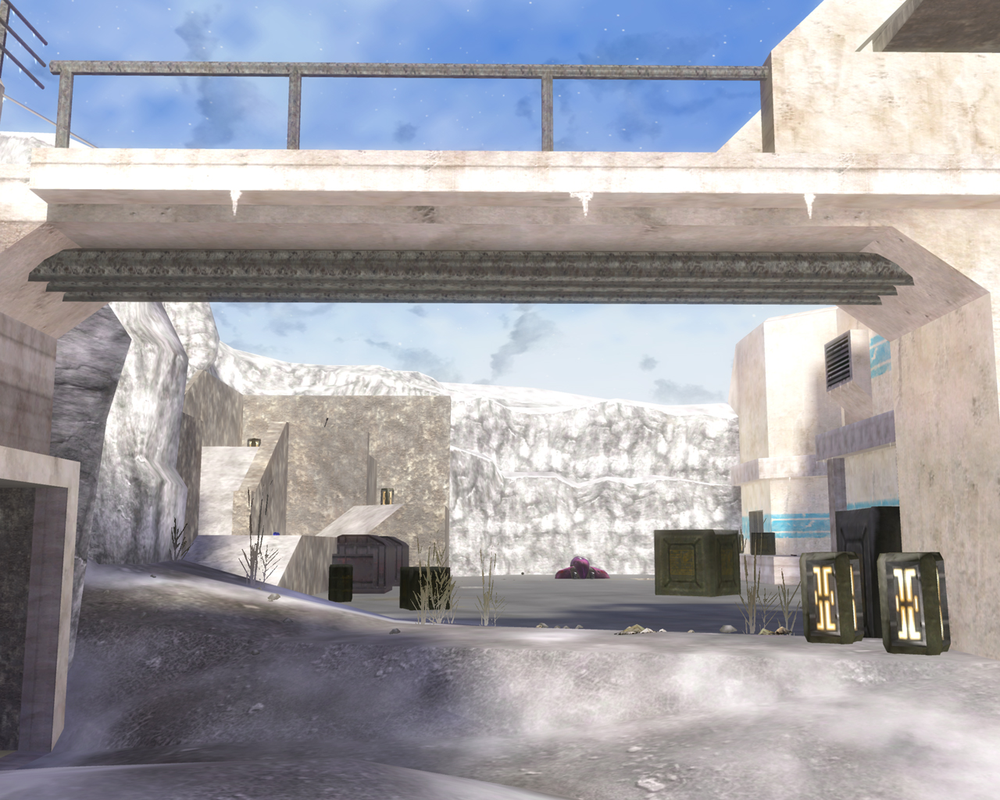
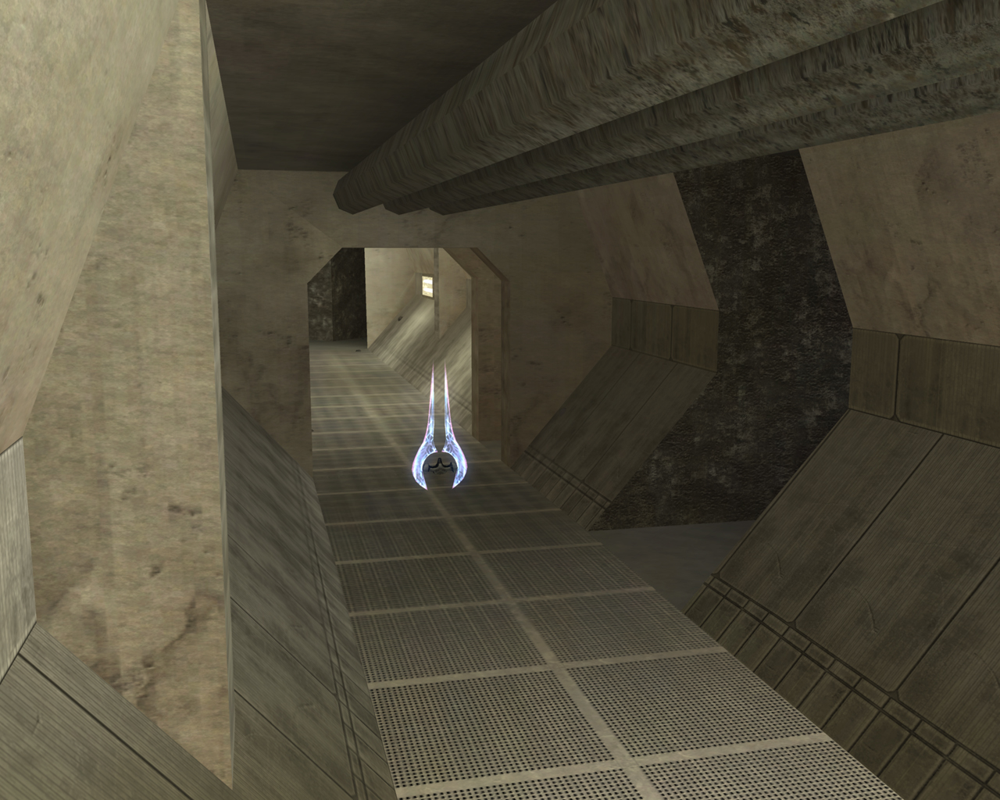
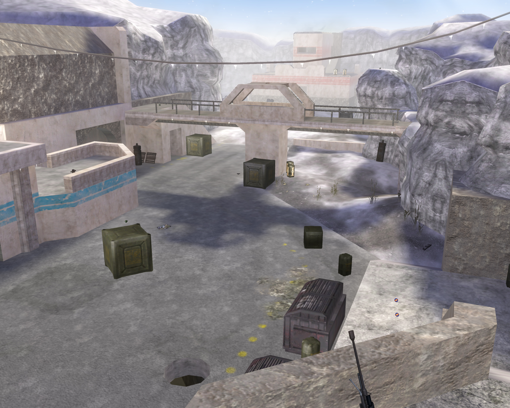

_Frostbite_ is a Halo 2 Vista map I released in 2007. The map takes place in Iqaluit, Canada, at a storage facility repurposed for UNSC training.

It was the only H2V content I made since the game's custom map scene mostly dried up soon after launch. Unfortunately, the shipped H2 editing kit was severely cut in features and the port performed poorly.

Frostbite can be [**downloaded here**](http://h2v.halomaps.org/index.cfm?pg=3&fid=2235). I also [released a model](http://hce.halomaps.org/index.cfm?fid=3187) for one of the bases and have seen it used in a few CE maps which is kinda cool.

## Screenshots

