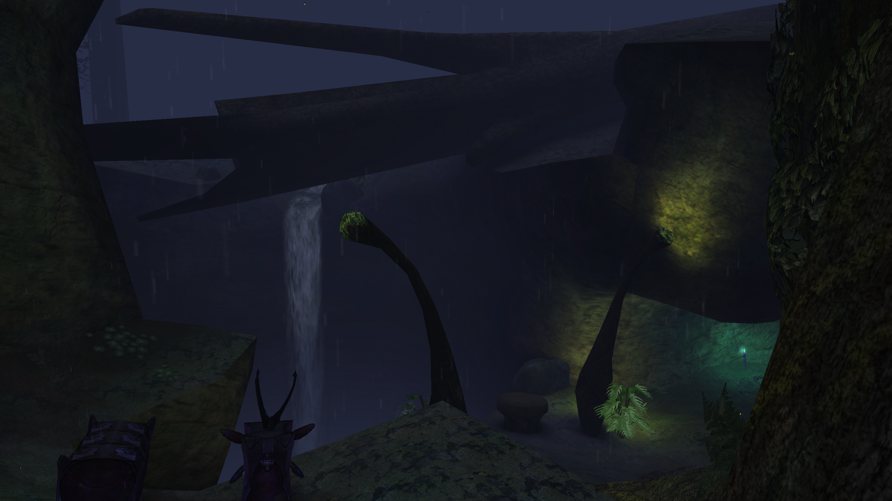

_[More screenshots below](#screenshots)_

_Warren_ is a Halo CE map I created during the Reclaimers Season 2 map contest in 2021. It takes visual inspiration from the campaign level _343 Guilty Spark_. It is medium-sized and asymmetric with a mix of overlapping outdoor and indoor paths. A two-way teleporter connects the lowest and highest positions of the map.

## Download
_Warren_ is open source. You can find sources and releases of its `.map` file here:

* https://github.com/csauve/warren
* https://opencarnage.net/index.php?/topic/8452-warren/
* https://t3hz0r-files.s3.amazonaws.com/halo/releases/warren/warren.zip

To install the map in Halo Custom Edition, simply place `warren.map` in Halo's `maps` folder. Warren is also available for automatic download in-game by client mods supporting the [HaloNet.net](http://maps.halonet.net/maplist.php) protocol, like [Chimera](https://chimera.opencarnage.net/).

## The making of _Warren_
Contestants needed to choose one of three different blockouts created by [Blaze Lightcap](https://www.artstation.com/blazedillon) and complete an art pass on them, as well as place items and spawns how the contestant saw fit. This was a really interesting contest because each of the different layouts had at least a couple maps made from them, so we got to see a lot of creativity and unique styles. People took maps in totally different visual directions from each other even if the layout was technically the same. For example, aLTis also used the same starting model as me to create the winning map, [Metrobyte][metro].

### Modeling
The contest rule was basically that you may not alter the layout of the starting model but are otherwise free to do what you want. Adding extra paths or teleporters would be against the rules. As one of the contest organizers, I imported Blaze's original model and prepared it for use in Halo. This would serve as the basis for any mappers who chose layout #3 to start with:

From the start of modeling I knew that I wanted to make the result almost unrecognizable, with lots of natural terrain to break up the flat surfaces of the starter model. What I ended up doing was essentially remodeling the map again but following the original model as a guide -- starting at one corner and slowly working my way out. What I liked about layout 3 is that it had a lot of verticality and overlapping paths, and mentally turning it into terrain reminded me of burrows or tunnels, hence the name.

I had zero plan for how I would remodel each part of the map. My general idea was to create a gloomy _343 Guilty Spark_-like environment but that level didn't have the same kind of verticality that Warren would, so I knew I'd have to blend it with the typical kinds of vertical cliffs you see in outdoor Halo levels. I modeled in large archways, gradual organic curves, and shelf-like protusions that invoke the shapes of Flood biomass as seen in Halo 3. Even the tree roots snake like tentacles to lend a hint that _the Flood is here_ and that the map belongs near the swamps of Alpha Halo.

A large Forerunner structure helps break up all the organic terrain and gives the map two clear "sides" despite being asymmetric. It has large non-playable extensions that exist above the play space and mainly serve to make the player feel small in comparison. I very much stole the idea of the tower from [Wallace's Earth headquarters](https://i.redd.it/jjjy0hoobbn71.jpg) in _Blade Runner 2049_. [The interior](pics/screenshot2.png) of this structure (red base) was the last to be modeled and is reinterpretation of the large halls found underground in the campaign mission but for a smaller space.

### Texturing
Most of the level's textures are lifted from the campaign level. This is by design because I like my maps to feel like they fit in with the game's originals. UV unwrapping was a bit of a challenge though.

Firstly, I created a lot of continous organic cliff walls with few places to hide seams. To compound the issue I wanted to use a cliff texture that tiled horizontally but not vertically. I mostly solved this by unwrapping sections of the cliff one at a time, warping them into wide rectangular shapes to fit the texture, then stitching those islands to adjacent ones. In a few cases where I couldn't avoid seams I either modeled in an interruption to the cliff or covered it with some foliage :)

The second UV unwrapping challenge were the trees. The game's lightmapper, Tool, was generating very poor automatic lightmap unwraps of these trees -- there were lighting seams everywhere and they didn't look smooth at all. I could force the lightmapper to re-use texture UVs for lightmaps, but I would have to ensure the texture UVs were non-overlapping. To get non-overlapping texture unwraps for the trees it took a lot of careful seam marking in Blender to ensure they unrolled flat.

After most of the texturing and UV unwrapping was done, I wanted to make the large tree trunks fit better into their surroundings by covering them with some vines and leaves. I brought a couple of my holiday photos from Malaysia into Krita and created a bump map and diffuse map from them:

The texture was mapped to 2x2 quads that were curved to the tree surface and raised in the middle to give the illusion of depth.

Finally, a bit of Halo shader work gave them cube mapped reflections so they looked wet and so the tone of green slightly varies depending on the viewing angle, adding variety.

### Lighting
Early in-game versions of the map confirmed that the overall mood and light level was what I wanted. The shapes I'd modeled throughout the map made great silhouettes in the fog and it all looked rather mysterious. Although I'd tweak the fog a few times, the main next focus would be localized lighting.

Covenant torches are a favourite of mine because they cast this nice blue light (great for blue base!) and lore-wise could plausibly exist anywhere the Covenant could go on the ring. The tags for these already exist in the game so you just need to place them. I would later end up creating variant tags of these torches with a slightly larger lighting radius so I could place fewer of them.

Since this was a _343 Guilty Spark_-themed map, I couldn't pass up the opportunity for some glowing fungal trees. Because they're modeled directly into the BSP in the original mission, I didn't have scenery I could easily place and so had to model some myself. To cast light I created invisible light-casting surfaces around their glowing bits that would take effect during lightmapping. The placement and orientation of these fungal trees were often chosen to cast light on nearby cliffs or objects, but also to serve as cover for players fighting around them.

<h2 id="screenshots">Completed map</h2>

After the modeling, texturing, and lighting were mostly in order, I turned to the final step of level population. This is where assorted scenery, weapons, spawns, decals, and other objects are placed around the map. I didn't do any playtesting with this map before the contest so my initial spawn placements were a bit rough and sloppy. Once the contest had finished I made a final version of the map that took into account feedback from contest gamenight players. This included a few layout changes to make the map more traversible, changed weapon spawn timers, better gametype-specific player spawns (especially for King), and some general polish.

[metro]: https://opencarnage.net/index.php?/topic/8404-metrobyte/